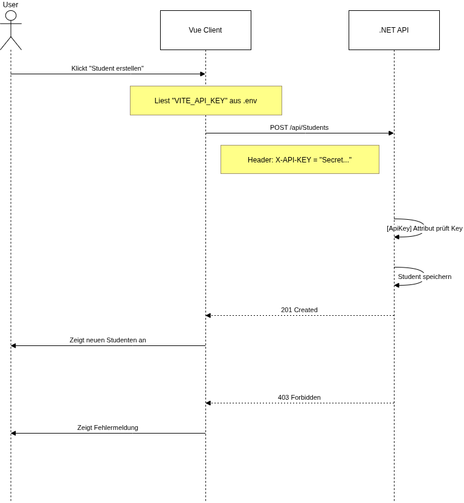
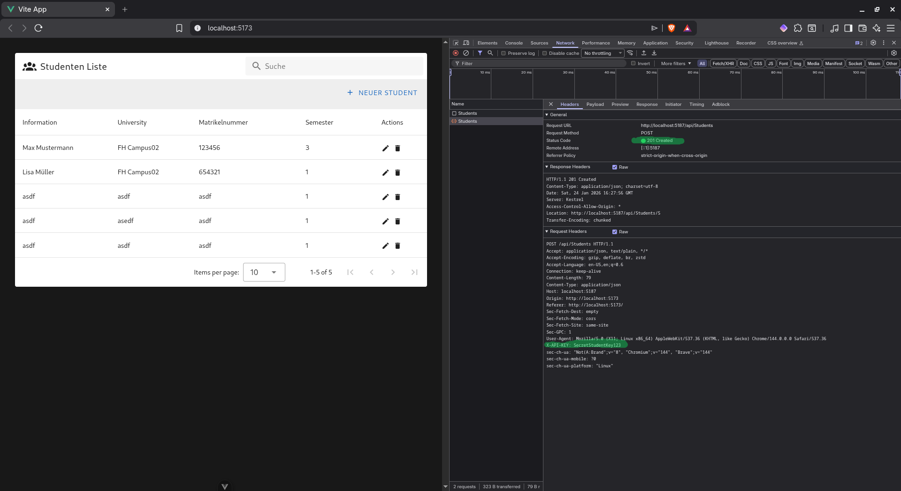
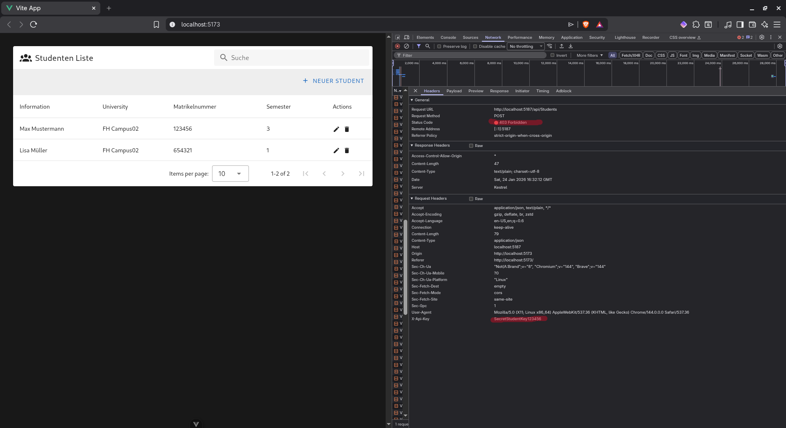

# ANWENDUNG

## Start mit Docker (Empfohlen)

Um das gesamte Projekt (Backend API und Client) ohne manuelle Installation von Abhängigkeiten zu starten, verwende Docker.

**1.**  Docker Desktop (oder Docker Engine) ist installiert und läuft.

**2.**  Öffnen Sie ein Terminal im Hauptverzeichnis des Projekts und führen Sie aus:

        ```bash
            docker compose up --build
        ```

**3.**  Zugriff:
        Sobald die Container laufen, sind die Dienste unter folgenden Adressen erreichbar:

        Client (App): http://localhost:5173
        Backend (Swagger UI): http://localhost:5187/swagger
        API Endpunkt: http://localhost:5187/api/students


---

# PROJEKTDOKUMENTATION: Student Administration Microservice

---

## AUFGABE 1: SERVICE BESCHREIBUNG & DOMAIN DRIVEN DESIGN (DDD)
---
(Bearbeitet von: [PLATZHALTER NAME])

[HIER PLATZHALTER FÜR DIE DOKUMENTATION DES KOLLEGEN]
- Bounded Context Beschreibung
- Context Map
- Ubiquitous Language
- Datenmodell Beschreibung

---

## AUFGABE 2: ASP.NET CORE WEB API CONTROLLER (CRUD)
---
(Bearbeitet von: Christopher Metnitzer)

Der "StudentsController" stellt die zentrale REST-Schnittstelle dar. 
Er implementiert vollständige CRUD-Operationen (Create, Read, Update, Delete) 
und nutzt die Semantik des HTTP-Protokolls korrekt aus.

Implementierte Endpunkte und HTTP-Verben:

1. GET (Read) - Safe Method
   - Route: /api/students
     Funktion: Liefert eine Liste aller Studenten.
     Status: 200 OK.
   
   - Route: /api/students/{id}
     Funktion: Liefert einen spezifischen Studenten.
     Status: 200 OK (gefunden) oder 404 Not Found (wenn ID ungültig).

2. POST (Create)
   - Route: /api/students
     Funktion: Erstellt eine neue Ressource.
     Status: 201 Created. 
     Besonderheit: Es wird der Standard "CreatedAtAction" verwendet, 
     um im HTTP-Header "Location" die URL zur neu erstellten Ressource 
     zurückzugeben.

3. PUT (Update) - Idempotent
   - Route: /api/students/{id}
     Funktion: Überschreibt einen existierenden Datensatz vollständig.
     Status: 204 No Content (Erfolg ohne Body) oder 400 Bad Request 
     (Validierungsfehler).

4. DELETE (Delete)
   - Route: /api/students/{id}
     Funktion: Entfernt einen Datensatz.
     Status: 204 No Content (Erfolg) oder 404 Not Found.


---

## AUFGABE 3: ASYNCHRONES MESSAGING & LOGGING
---
(Bearbeitet von: [PLATZHALTER NAME])

[HIER PLATZHALTER FÜR DIE DOKUMENTATION DES KOLLEGEN]


## AUFGABE 4: OPENAPI SPEZIFIKATION
---
(Bearbeitet von: [PLATZHALTER NAME])

[HIER PLATZHALTER FÜR DIE DOKUMENTATION DES KOLLEGEN]


## AUFGABE 5: SERVICE-KLASSE & DEPENDENCY INJECTION
---
(Bearbeitet von: Christopher Metnitzer)

Um die Architektur sauber zu halten ("Separation of Concerns"), wurde 
keine Logik im Controller implementiert. Stattdessen kommt das 
Service-Pattern zum Einsatz.

Architektur-Komponenten:
1. IStudentService (Interface): Definiert den Vertrag und ermöglicht 
   Mocking/Testing.
2. StudentService (Implementation): Beinhaltet die Geschäftslogik und 
   die Datenhaltung (In-Memory Liste).

Dependency Injection (DI) Strategie:
Die Registrierung erfolgt in der Program.cs mittels:
"builder.Services.AddSingleton<IStudentService, StudentService>();"

Begründung der Scope-Wahl "Singleton":
Da in diesem Projekt keine persistente Datenbank (wie SQL) verwendet wird, 
sondern die Daten zur Laufzeit in einer List<Student> im Arbeitsspeicher 
liegen, ist "Singleton" zwingend erforderlich.
- Bei "AddScoped" oder "AddTransient" würde bei jedem HTTP-Request eine 
  neue, leere Liste erstellt werden. Daten wären sofort verloren.
- "AddSingleton" garantiert, dass dieselbe Instanz (und damit die Daten) 
  über die gesamte Laufzeit der Applikation verfügbar bleiben.

---

## AUFGABE 6: CLIENT APPLIKATION
(Bearbeitet von: Thomas Proksch)

### Client-Architektur & API-Nutzung

Der Client ist eine Vue 3 Single Page Application (SPA), die Pinia für das State Management und Axios für die HTTP-Kommunikation verwendet.

#### 1. Der Store (studentStore.ts)
Der StudentStore fungiert als Single Source of Truth. Er hält den aktuellen Zustand der Anwendung so, dass alle UI-Komponenten (z. B. Tabellen, Formulare) immer synchron sind.

- **State (Zustand):**
  - students: Eine Liste aller geladenen Studenten-Objekte.
  - loading: Ein Boolean-Flag, um Lade-Spinner in der UI anzuzeigen, während Daten geholt werden.
  - error: Speichert Fehlermeldungen, um sie dem Benutzer anzuzeigen (z. B. "Server nicht erreichbar").

- **Actions (Logik):**

  - Hier findet die eigentliche Arbeit statt. Die Actions (fetchStudents, createStudent, etc.) sind asynchrone Funktionen, die die HTTP-Aufrufe kapseln.

#### 3. Der Datenfluss (Ablauf)
1. **UI-Interaktion**: Der Benutzer klickt auf "Speichern" in der Vue-Komponente.

2. **Store-Aufruf**: Die Komponente ruft studentStore.createStudent(daten) auf.

3. **API-Request**: Der Store nutzt Axios, um einen APi-Request (POST) inkl. Security-Header an den Server zu senden.

4. **State-Update:**
    - Erfolg: Der Server antwortet mit dem neuen Studenten. Der Store fügt diesen direkt zum students-Array hinzu (die UI aktualisiert sich automatisch).
   - Fehler: Der Store fängt den Fehler, setzt den error-State und wirft den Fehler weiter, damit die UI eine Meldung anzeigen kann.

#### 2. HTTP-Kommunikation (Axios)
Axios wird innerhalb der Store-Actions verwendet, um Requests an das .NET Backend zu senden.

  - Konfiguration: Die Basis-URL der API wird aus den Umgebungsvariablen (import.meta.env.VITE_API_BASE_URL) geladen. Das macht den Wechsel zwischen Localhost und Produktion einfach.
  - Sicherheit (API Key):
  In der createStudent-Action wird Axios so konfiguriert, dass der API-Key im Header mitgeschickt wird.

---

## AUFGABE 7: ROUTING
---
(Bearbeitet von: [PLATZHALTER NAME])


[HIER PLATZHALTER FÜR DIE DOKUMENTATION DES KOLLEGEN]
(Hinweis: Das Standard-Routing [Route("api/[controller]")] wurde von 
Christopher im Backend bereits implementiert. Custom Routes fehlen noch.)

---

## AUFGABE 8: REST PRINZIPIEN
---
(Bearbeitet von: Christopher Metnitzer)


Der Service wurde strikt nach den Design-Prinzipien von Roy Fielding (REST) 
entwickelt. Besonders hervorzuheben sind:

A) Statelessness (Zustandslosigkeit)
Der Server speichert keinen Client-Kontext (Session State) zwischen zwei 
Anfragen. Jeder Request (z.B. GET /api/students/1) enthält alle Informationen, 
die zur Verarbeitung notwendig sind.
Vorteil: Der Service ist beliebig horizontal skalierbar, da keine Session-
Affinität benötigt wird.

B) Uniform Interface (Einheitliche Schnittstelle)
Die API ist ressourcen-orientiert aufgebaut. Die URIs enthalten Nomen 
(/api/students), keine Verben (/api/createStudent). Die Manipulation 
der Ressourcen erfolgt ausschließlich über die standardisierten HTTP-Verben 
(GET, POST, PUT, DELETE), was die Schnittstelle für Entwickler intuitiv 
nutzbar macht.

---

## AUFGABE 9: NUTZUNG DER APPSETTINGS.JSON
(Bearbeitet von: Christopher Metnitzer)

Um Hardcoding im Quellcode zu vermeiden ("Configuration over Code"), 
wurden variable Parameter in die Konfigurationsdatei ausgelagert.

Struktur in appsettings.json:
"UniversitySettings": {
  "Name": "FH Campus02 Business Analytics & AI",
  "Semester": "Wintersemester 2025/2026",
  "MaxStudentsPerCourse": 20
}

Implementierung:
Die Werte werden über das Interface "IConfiguration" mittels Dependency 
Injection in den Controller geladen. Dies ermöglicht es, Umgebungsvariablen 
(z.B. Semester) zu ändern, ohne den Code neu kompilieren und deployen 
zu müssen.

---

## AUFGABE 10: PROJEKTTEAM & AUFWAND
---
(Bearbeitet von: Team)


Übersicht der Verantwortlichkeiten und des geschätzten Aufwands:

MITGLIED 1: Christopher Metnitzer
---------------------------------
Aufgabenbereich: Backend Core Implementation
(Aufgaben 2, 5, 8, 9: Controller, Services, DI, REST, Config)
Aufwand: ca. 3 Stunden

MITGLIED 2: [PLATZHALTER NAME]
------------------------------
Aufgabenbereich: [PLATZHALTER]
Aufwand: [PLATZHALTER]

MITGLIED 3: [PLATZHALTER NAME]
------------------------------
Aufgabenbereich: [PLATZHALTER]
Aufwand: [PLATZHALTER]

MITGLIED 4: [PLATZHALTER NAME]
------------------------------
Aufgabenbereich: [PLATZHALTER]
Aufwand: [PLATZHALTER]

---


## AUFGABE 11: FUNKTIONIERENDE GESAMTLÖSUNG
---
(Status des Gesamtprojekts)

[PLATZHALTER: LINK ZUR ZIP DATEI ODER STATUSBERICHT]

---

## AUFGABE 12: AUTHENTIFIZIERUNG & SECURITY
---
(Bearbeitet von: Thomas Proksch)
---

### Arten der Authentifizierung im Web

#### API-Key

##### Definition

Mittels API Keys ist es möglich API-Nutzer zu identifizieren bzw. die API-Anfrage zu verifizieren, ohne den tatsächlichen Nutzer zu kennen. 
Dazu wird der API-Key mit jeder API-Anfrage mitgesendet und die Applikation autorisiert den Zugriff, oder lehnt den Zugriff ab.
Wie der API-Key übermittelt wird unterscheidet sich je nach API.

Möglichkeiten zur Übermittlung sind zB:

- Query Parameter

- API-Header

- API-Body

##### Vorteil von API-Keys

- Einfach zu implementieren


##### Nachteil von API-Keys

- Nutzer des API-Keys unbekannt

- Kann geleakt werden

##### Anwendung

API-Keys funktionieren wenn du eine Applikation authentifizierst, die dein Service nutzen möchte. Außerdem eignen sich API-Keys gut zur Monetarisierung eines Services und du die Häufigkeit der API-Anfragen regeln möchtest.

---

#### HTTP Basic Auth

##### Definition

HTTP Basic Auth ist eine einfache Möglichkeit einen User zu identifizieren. Dabei wird der Username und das Userpasswort kodiert und als Header in **jeder** HTTP-Anfrage mitgesendet.
Die kodierte Useridentifikation wird dabei ähnlich wie ein API-Key genutzt.

##### Vorteil

- Standardisierter Weg seine Berechtigung zu übermitteln

- Der HTTP-Header ist immer gleich

- Leichte Implementierung

##### Nachteil

- Die App muss das Userpasswort kennen

- Intransparente Passwortnutzung seitens der App möglich

- Die App hat Vollzugriff auf das Benutzerkonto

- Keine Zwei-Faktor-Authentifizierung möglich


##### Anwendung

HTTP-Auth ist eine einfache Möglichkeit zur Identifikation von Nutzern. Diese Methode sollte nur dann angewandt werden, wenn Sicherheit kein Risiko darstellt. Auf Grund des Sicherheitsrisikos findet HTTP-Auth heute kaum noch eine Anwendung.

---

#### OAuth 2.0

##### Definition

OAuth 2.0 ist einen auf Token basierte Architektur. Der Token, den das Service und die Applikation zur Authentifizierung verwenden, wird dabei von einem Dritten, einem Authentifizierungsserver, erstellt. Mit diesem Protokoll können Applikationen, im Namen des Nutzers, nach Zugriff auf Services fragen. Zum Beispiel kann deine Healthapplikation auf dem Smartphone, nach deinen Fitnessdaten deiner Sportswatch fragen.

###### Erstellung des Authentifizierungstokens

1. Eine Applikation fragt User nach Zugriff auf ein Service
1. Die Applikation macht eine Anfrage zur Erstellung eines Tokens an den Autorisations Server.
1. Der Autorisations Service erlaubt einer Drittanwendung und der Token wird ausgetauscht.
1. Applikation hat mit dem Token Zugriff auf das Service

##### Vorteil

- Sicherheit, Nutzerdaten bleiben geschützt
- Geregelter Zugriff auf einzelne Services
- Single Responsibility Prinzip
- Zwei-Faktor-Authentifizierung möglich

##### Nachteil

- Komplexität
- Single Point of Failure (Autorisierungsserver)
- Tracking & Datenschutz

##### Anwendung

Wenn du in einer Zero Trust Umgebung (**Internet**) mit persönlichen Informationen arbeitest, solltest du auf eine Token basierte Authentifizierung zurückgreifen, die auch Zwei-Faktor-Authentifizierung ermöglicht und einen externen Autorisierungsserver nutzt.

---

### Implementierung API-Key Authentifizierung

Die Absicherung des „Student Erstellen“-Endpunkts erfolgt durch einen Custom Action Filter in ASP.NET Core.

1. Konfiguration (appsettings.json):
Der gültige API-Schlüssel ist zentral in der Konfigurationsdatei als "ApiKey": "SecretStudentKey123" hinterlegt. Das trennt Secret und Code.

2. Validierungs-Logik (ApiKeyAttribute.cs):
Ein benutzerdefiniertes Attribut ([AttributeUsage(AttributeTargets.Method)]) fängt den Request ab, bevor er den Controller erreicht.

    - Es extrahiert den Wert aus dem HTTP-Header X-API-KEY.
    - Es vergleicht diesen Wert mit dem Eintrag in der appsettings.json.
    - Stimmt der Schlüssel nicht überein, bricht die Pipeline sofort mit 401 Unauthorized oder 403 Forbidden ab.

3. Anwendung (StudentsController.cs):
Das Attribut [ApiKey] wird deklarativ nur über der Create-Methode (POST) platziert. Dadurch bleibt die API für Lesezugriffe (GET) öffentlich zugänglich, während schreibende Operationen geschützt sind.







---

### Security Principles nach Saltzer und Schroeder[^1]

#### Echonomy of Mechanism

*Keep it small and simple*

Ein Fehler in der Sicherheit wird bei normaler Nutzung nicht entdeckt werden. Daher muss der Code Zeile für Zeile überprüft werden. Um das Überprüfen so einfach zu machen, soll der Code klein und simpel sein.

#### Fail-safe Defaults

*Access by permission, not exclusion*

Der Standardzustand sollte immer "kein Zugriff" sein. Berechtigungen werden explizit vergeben. Wenn ein Fehler im System auftritt, führt das dazu, dass das der Zugriff verweigert wird.

#### Complete Mediation

*Check everything, every time*

Jeder Zugriff auf jedes Objekt muss jedes Mal geprüft werden. Es darf keine "Abkürzungen" geben, bei denen das System sich auf eine frühere Prüfung verlässt, da sich Berechtigungen zwischenzeitlich geändert haben könnten.

#### Open Design

*No security by obscurity*

Die Sicherheit des Systems darf nicht davon abhängen, dass der Angreifer nicht weiß, wie es funktioniert. Das Design sollte öffentlich bekannt sein können, ohne die Sicherheit zu gefährden. Nur die Schlüssel (Passwörter/Tokens) müssen geheim bleiben.

#### Separation of Privilege

*Two keys are better than one*

Ein Sicherheitsmechanismus ist stärker, wenn er von mehreren Bedingungen abhängt (Zwei-Faktor-Authentifizierung). So kann ein einzelner Fehler oder ein korrupter Mitarbeiter nicht das gesamte System kompromittieren.

#### Least Privilege

*Only the bare minimum*

Jeder Nutzer und jedes Programm sollte nur die Rechte haben, die für die aktuelle Aufgabe zwingend notwendig sind. Das begrenzt den potenziellen Schaden, falls ein Account gehackt wird oder ein Programm einen Bug hat.

#### Least Common Mechanism

*Don't share more than necessary*

Minimiere Mechanismen, die von vielen Nutzern gleichzeitig verwendet werden (zB geteilte Dateien oder globale Variablen). Geteilte Ressourcen sind potenzielle Wege für Angreifer, um von einem Nutzer zum anderen zu gelangen.

#### Psychological Acceptability

*Easy to use, hard to bypass*

Sicherheit muss für den Nutzer einfach und verständlich sein. Wenn Sicherheitsmaßnahmen zu kompliziert sind oder die Arbeit behindern, werden Nutzer Wege finden, sie zu umgehen und damit das gesamte System schwächen.

[^1]: [The Security Principles of Saltzer and Schroeder](https://shostack.org/blog/the-security-principles-of-saltzer-and-schroeder)

